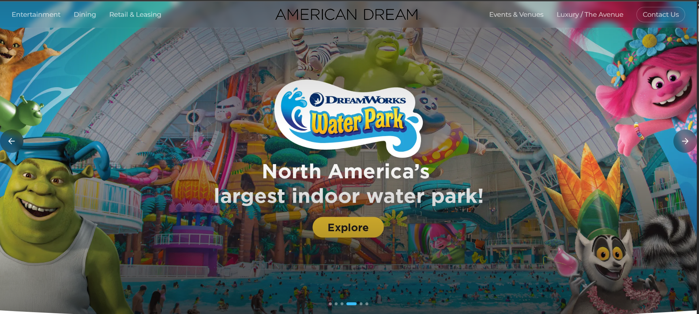

# American Dream — Interactive Sales Deck 🏙️

## 🌐 Live Demo
**[american-dream-delta.vercel.app](https://american-dream-delta.vercel.app)**

---

## 📌 Overview

A fully interactive, browser-based sales deck built for **American Dream** — one of the world's largest shopping and entertainment destinations (East Rutherford, NJ).

This tool replaces the fragmented pitch process used by commercial teams — no more switching between PDFs, videos, and spreadsheets. It's a single, self-contained experience that a salesperson can screen-share on a live call or send as a standalone link for prospects to explore alone.

**Primary audiences:**
- Prospective retail tenants (luxury flagships, mid-tier, pop-ups)
- Corporate sponsors and brand partners
- Event promoters and producers

**Every section drives toward one of three actions:** leasing inquiry, sponsorship conversation, or event booking.

---

## 🚀 Tech Stack

| Tool | Purpose |
|---|---|
| **React 18 + TypeScript** | Component-based UI, type safety |
| **Vite** | Fast build tool and dev server |
| **Tailwind CSS v3** | Utility-first styling |
| **Framer Motion** | Scroll animations, page load transitions, stagger effects |
| **Swiper.js** | Hero slider, brand logo carousel, store sliders |
| **Lenis** | Smooth scroll experience |

---

## 🧩 Key Features

- 🎥 **Video-first hero** — cinematic autoplay with animated text overlay
- 🎠 **Multi-section sliders** — Luxury Avenue, Dining, Brand logos (infinite scroll)
- 📊 **Animated stat counters** — scroll-triggered number animations
- 🏪 **Attraction cards** — 3×2 grid with character artwork and overflow buttons
- 🗺️ **Plan Your Visit** — static map with Google Maps + Apple Maps deep links
- 🧭 **Non-linear navigation** — fixed navbar lets prospects jump to any section
- 📱 **Responsive** — desktop and tablet optimized, mobile friendly
- ⚡ **Performance** — lazy loading, code splitting, `preload="none"` on offscreen video

---

---

## 📂 Project Structure

```
src/
│── assets/              # Images, logos, static files
│── components/          # Shared and reusable components
│   ├── constants/       # Static data (brands, dining, etc.)
│   ├── layout/          # Layout components (Navbar, Footer)
│   ├── sections/        # Page sections (Hero, Dining, etc.)
│   ├── ui/              # Small reusable UI components
│
│── data/                # External/static data sources
│── hooks/               # Custom React hooks
│── App.tsx              # Root component
│── main.tsx             # Entry point
│── index.css            # Global styles
```

---

---

## 🧠 AI Tools Used

- **Claude (Anthropic)** — primary tool used throughout the build for architecture planning, component generation, design decisions, iterative debugging, and copy writing
- AI was used to accelerate development, not replace decision-making — every suggestion was reviewed, tested, and refined

---

## 📦 Installation & Setup

```bash
# Clone the repository
git clone https://github.com/JashanSaini11/american-dream.git

# Navigate into the project
cd american-dream

# Install dependencies
npm install

# Run development server
npm run dev
```

---

## 🛠️ Scripts

```bash
npm run dev       # Start development server
npm run build     # Build for production
npm run preview   # Preview production build
```

---

## 📸 Preview

<p align="center">
  
</p>

---

## 📈 Future Improvements

- Sponsorship module with partnership tiers and audience data
- Events & Venue platform with capacity specs and booking CTA
- Leasing path sub-modules segmented by category
- CMS integration so the commercial team can update content without code
- Analytics layer to track prospect engagement per section
- Lighthouse score optimization to 90+

---

## 📄 License

This project is open-source and available under the MIT License.
---

## 🤝 Contributing

Contributions are welcome. Feel free to fork the repo and submit a pull request.

---

## 📄 License

This project is open-source and available under the MIT License.

---

## 💡 Notes

This project emphasizes **clean architecture, animation performance, and UI consistency**, making it a strong base for scalable front-end applications.
